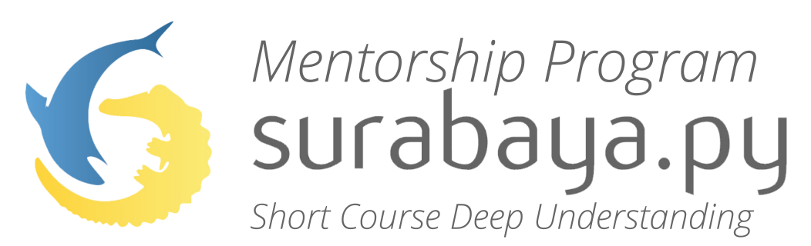

# Surabaya.py Mentorship Program

**Ada yang baru nih!**. Surabaya.py adalah Komunitas (Bahasa Pemrograman) Python Surabaya yang membantu meningkatkan kemampuan pemrogramannya khususnya di bidang teknologi. Biasanya kami mengadakan workshop dan seminar. Namun kami sekarang mencoba menawarkan kegiatan baru: **Mentorship Program**.

> **Mentorship program adalah program 3 hingga 4 minggu dimana membahas secara mendalam sebuah topik serta berbagai latihan bersama mentor yang berpengalaman.**

## Alur Mentorship Program

Untuk lebih jelasnya, bisa dilihat alur kegiatan sebagai berikut:

* Mendaftar ke https://surabaya-py.github.io dan bergabung ke grup telegram http://t.me/surabayadotpy
* Pilih topik yang ingin diikuti. Dapat dilihat [di sini](https://github.com/surabaya-py/mentorship-program/tree/master/topik) atau di folder topik.
* Setujui dan selesaikan [persyaratan umum](#syarat-peserta) dan khusus (pada masing masing topik) yang diminta.
* Mengikuti pertemuan ke 0 hingga selesai dan secara aktif berkomunikasi dengan yang lain.
* Membuat project dan mempresentasikannya.

## Keuntungan Menjadi Peserta

* Mendapatkan jaringan dari pelaku IT yang telah terjun langsung maupun teman seperjuangan.
* Mendapatkan ilmu *best practice* secara mendalam dan melatih intuisi bersama.
* Sertifikat online yang menandakan telah menyelesaikan pelatihan dan project.
* Dan keuntungan lainnya sebagai anggota komunitas aktif Surabaya.py.

## Syarat Peserta

* Peserta menggunakan laptop milik pribadi dan membawanya pada setiap kegiatan.
* Peserta menyatakan mampu untuk hadir dan aktif pada setiap kegiatan yang diadakan hingga akhir program.
* Sangat disarankan untuk mendaftar sebagai kelompok dua orang [(kenapa?)](#peserta), namun diperbolehkan untuk mendaftar sendiri.
* Peserta menyatakan bersedia jika nanti diminta untuk menjadi mentor atau pembicara.
* Peserta membayar commitment fee yang akan dikembalikan 75% setelah mengikuti seluruh rangkaian acara [(kenapa?)](#commitment-fee). Besaran commitment fee berbeda tergantung topik yang dibahas namun dalam kisaran Rp100.000,-.
* Peserta tidak akan membuat dan atau terlibat konflik antar peserta, mentor atau panitia pada sebelum, saat dan setelah kegiatan.

## Tertarik Menjadi Mentor?
Kirimkan pesan ke grup [telegram](http://t.me/surabayadotpy) tentang apa yang mau di bahas. Nanti kita akan ngopi bareng buat membahas lebih dalam.

## FAQ
### Peserta
> Saya tidak bisa pemrograman python, apa yang harus saya lakukan?

Mulai dari install, pelajari dasar-dasarnya dan mulai mencoba hal-hal yang kamu suka. Python dapat digunakan untuk website, data, image processing dan sebagainya. Agar dapat memanfaatkan semaksimal mungkin program ini, pengetahuan dasar sangat dibutuhkan agar pengaplikasian ilmu bisa lebih cepat.

> Mengapa direkomendasikan mendaftar sebagai kelompok dua orang?

Manusia memiliki niat yang naik turun. Dengan punya teman seperjuangan dari awal maka semangat untuk belajar akan dapat saling berbagi dan menyemangati. Project yang akan dikerjakan juga akan dikerjakan bersama sehingga semakin meningkatkan pengalamanmu untuk bekerja bersama tim.

**Perlu diingat**, pada dunia kerja yang sebenarnya, tidak ada yang bekerja sendiri. Maka ini juga sekaligus melatih bekerja secara tim.

> Apa yang terjadi jika saya mendaftar sendirian?

Jika memenuhi syarat maka akan tetap diterima, lalu akan dipasangkan dengan peserta lain.

> Apa yang terjadi jika saya tidak diterima?

Tetap semangat! Kami akan memberitau jika ada kegiatan lagi. Kamu juga bisa datang di project day dimana peserta yang diterima akan melakukan presentasi tentang apa yang mereka buat selama program berjalan.

### Commitment Fee

> Mengapa harus membayar commitment fee?

Hal ini untuk memberikan tanggung jawab lebih kepada peserta untuk dapat menyelesaikan program hingga tuntas.

> Kemana 25% uang dari commitment fee?

Dana 25% digunakan sebagai sebuah apresiasi kepada mentor agar dapat memberikan materi yang semakin berkualitas dan selalu berkarya. Ya itu juga akan kalian dapatkan ketika menjadi mentor juga.

> Apa yang terjadi dengan jika saya tidak bisa menghadiri salah satu kegiatan meetup?

Jika alasan ketidakhadiran bukan karena *force majeure* maka commitment fee akan dianggap hangus.

> Bagaimana nasib uang yang telah hangus?

Kami akan menggunakan sistem pelaporan yang transparan dan penggunaann untuk membangun komunitas yang lebih berkualitas.

## Kategori 

-Web Development :
Mengenal lebih detail tentang web development tapi lebih mengarah ke backend

-IoT:
Mempelajari IoT mulai dari komunikasi sampai dengan cara memrogram microcontrollernya

-Data Visualization:
Mempelajari tentang cara memvisualisasikan data menggunakan matplotlib
